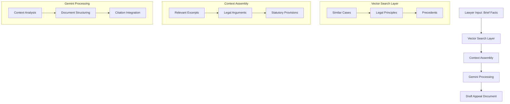

# Vector Search Benefits and RAG Integration

## Overview
This document outlines the benefits of vector search in the legal research assistant system and explains how it integrates with Retrieval Augmented Generation (RAG) for drafting legal appeals.

## Vector Search Benefits

### 1. Semantic Understanding
- **Beyond Keyword Matching**
  - Traditional search limitations
  - Semantic meaning capture
  - Context-aware results
  
- **Language Flexibility**
  - Handles varying legal terminology
  - Matches similar concepts
  - Cross-language support (English/Urdu)

- **Example Matching**
```
User Input: "tenant refused to pay rent and damaged property"
↓
Matches Cases About:
- "lessee defaulted on payment and caused deterioration of premises"
- "occupant failed to tender monthly consideration and impaired asset condition"
- "kiraydar ne kiraya ada nahi kiya aur jaidad ko nuqsan pohanchaya"
```

### 2. Contextual Matching Capabilities

#### Fact Pattern Matching
- Similar case scenarios
- Analogous situations
- Jurisdiction-specific patterns

#### Legal Principle Alignment
- Related legal doctrines
- Similar judicial interpretations
- Precedent applications

#### Relief Pattern Recognition
- Similar granted reliefs
- Successful prayer formats
- Jurisdiction preferences

## RAG Integration for Appeal Drafting

### 1. Enhanced RAG Pipeline



### 2. Process Flow Details

#### Input Processing
```python
# Example flow structure
class AppealProcessor:
    def process_appeal_request(self, brief_facts: str):
        # 1. Vector search for relevant cases
        relevant_cases = self.vector_search.find_similar_cases(brief_facts)
        
        # 2. Context assembly
        context = self.context_assembler.build_context(
            brief_facts=brief_facts,
            relevant_cases=relevant_cases
        )
        
        # 3. Generate appeal draft
        appeal_draft = self.gemini_processor.generate_appeal(context)
        
        return appeal_draft
```

### 3. Practical Benefits

#### Research Quality Improvements
- Comprehensive case law coverage
- Identification of subtle legal principles
- Discovery of analogous fact patterns
- Access to emerging legal trends

#### Time Efficiency Gains
- Reduced manual research time
- Quick precedent identification
- Automated initial drafting
- Focus shift to strategic aspects

#### Argument Enhancement
- Pattern recognition in successful arguments
- Preemptive counter-argument identification
- Cross-jurisdictional support
- Strengthened legal reasoning

### 4. Use Case Examples

#### Appeal Drafting Workflow
```
Input: Contract Breach Case
↓
Vector Search Results:
1. Similar breach cases
2. Successful relief patterns
3. Proof requirements
4. Statutory interpretations
↓
Generated Content:
- Structured grounds
- Legal arguments
- Authority citations
- Relief formatting
```

#### Legal Research Process
```
Input: Employment Termination
↓
Retrieved Context:
1. Employment law precedents
2. Similar termination cases
3. Compensation arguments
4. Procedural requirements
↓
Analysis Output:
- Legal principles
- Outcome predictions
- Evidence requirements
- Strategic guidance
```

### 5. Gemini Integration Benefits

#### Enhanced Output Quality
- Contextually relevant responses
- Jurisdiction-aware drafting
- Proper legal terminology
- Accurate citations

#### Improved Reasoning
- Precedent-based arguments
- Structured legal analysis
- Counter-argument handling
- Relief justification

### 6. Pakistani Legal Context

#### Jurisdiction-Specific Benefits
- **High Court Integration**
  - Cross-provincial precedent finding
  - Similar bench decisions
  - Consistent relief patterns

- **Supreme Court Alignment**
  - Binding precedent identification
  - Constitutional interpretation
  - Fundamental rights cases

- **Islamic Law Integration**
  - Shariah principle matching
  - Islamic legal maxims
  - Religious authority citations

#### Language Support
- Bilingual case matching
- Cross-language precedent finding
- Terminology standardization

## Implementation Considerations

### 1. Technical Setup
- Vector database configuration
- Embedding model selection
- Integration architecture
- API design

### 2. Quality Assurance
- Result relevance validation
- Citation accuracy checking
- Legal principle verification
- Output format standardization

### 3. Performance Optimization
- Query response time
- Context assembly efficiency
- Generation speed
- Resource utilization

### 4. Maintenance Requirements
- Regular model updates
- Database maintenance
- Citation updates
- Performance monitoring

## Future Enhancements

### 1. Advanced Features
- Multi-jurisdictional search
- Temporal precedent weighting
- Dynamic context assembly
- Automated quality checks

### 2. Integration Possibilities
- Court filing systems
- Case management software
- Legal research platforms
- Document management systems

## Conclusion
Vector search significantly enhances the legal research and appeal drafting process by providing semantic understanding, contextual matching, and improved RAG integration. This leads to better quality outputs, increased efficiency, and more comprehensive legal analysis. 